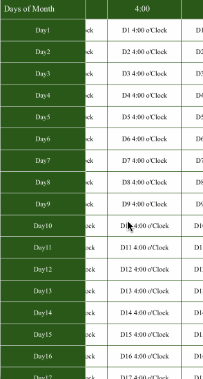

<p align="center">
  
</p>

<p align="center"> <b> BASReport </b></p> 


[](https://travis-ci.org/badalpub1991@gmail.com/BASReport)
[](https://cocoapods.org/pods/BASReport)
[](https://cocoapods.org/pods/BASReport)
[](https://cocoapods.org/pods/BASReport)


# BASReport
## Requirements
`BASReport` works on iOS 8.0+. It depends on the following Apple frameworks, which should already be included with most Xcode templates:

* Foundation.framework
* UIKit.framework

## Installation

### CocoaPods

[CocoaPods](http://cocoapods.org) is the recommended way to add BASReport to your project.

1. Add a pod entry for BASReport to your Podfile 
```ruby
pod 'BASReport'
```
2. Install the pod(s) by running `pod install`.
3. Include BASReport wherever you need it with `import BASReport"`.

## Overview

4 examples Added in Project

<p float="left">
    
    
    
    

</p>

## Getting Started

### Storyboard
- Go to **main.storyboard** and add a **blank UIView**
- Open the **Identity Inspector** and type '**BASCustomReport**' the '**class**' field
- Make sure you have '**BASReport**' selected in '**Module**' field


### Code
```swift
import BASReport

class BASReportExample: UIViewController {
   //Outlets
   @IBOutlet weak var basReport: BASCustomReport!
   
   override func viewDidLoad() {
        super.viewDidLoad()
              self.basReport.delegate = self
              initialSetup()
    }
    
      func initialSetup() {
           /* Set Header as! OrderedDictionary
            1) Object , Distance , Running etc set as Header
            2) Boolian value -> true if you want to set image , false if not set image
            and then pass it to BASReport
           */
           
           var HeaderDict = OrderedDictionary<String, Bool>()
                            HeaderDict["Object"] = false ; 
                            HeaderDict["Distance"] = false ;
                            HeaderDict["Running"] = false ;
                            HeaderDict["Idle"] = false ;
                            HeaderDict["Max Temperature"] = false; 
                            HeaderDict["Min Temperature"] = false;
                            HeaderDict["No Of Times Above Ideal"] = false
           self.basReport.arrGHeader = HeaderDict
           //*--------------------------------------------------------*//
        
         setData()
       }
       
       //Webservice Call to get Data
       func setData() {
           if let path = Bundle.main.path(forResource: "Example", ofType: "json") {
            do {
                     let data = try Data(contentsOf: URL(fileURLWithPath: path), options: .mappedIfSafe)
                     let tempData  = try JSONDecoder().decode(RootClass.self, from: data )
                     //Store Data in Global Array
                     self.sampleData = tempData.data!
               /*Send Dictionary keys to BASReport
                 1) Key received from JSON 2) Allignment of Text  3) Custom size for cell 4) Color of Cell or Text
                 */
               self.basReport.arrGKeys =  [("object",.left,nil , nil) ,
                                           ("distance",.center,100.0 , nil) , 
                                           ("running",.center,nil , nil) , 
                                           ("idle",.center,80.0 , nil) , 
                                           ("max_temperature",.center,nil , nil) , 
                                           ("min_temperature",.center,nil , nil) , 
                                           ("no_below_ideal",.center,nil , nil) ]
               //Send your Data to BASReport in Dictionary form
                if basReport.arrGHeader.count == basReport.arrGKeys.count{
                          self.basReport.arrReportSummaryDict = arryToDict(array: self.sampleData)
                  }
                } catch {
                      // handle error
                 }
           }
           
       }
extension BASReportExample : BASReportDelegate {
    func didSelectCellAt(indexPath: IndexPath, tableHint: String, basReport: BASCustomReport?) {
       //When userTapped on particular cell
    }

}
```

## Customization
#### CustomDataSource for CustomHeader

```swift
  //Refer example 4. BASReport with CustomCell
  ///This datasource is used to Display customCells for Header in **TableViewData**
       weak public var basReportHeaderDatasource: BASReportHeaderDatasource?
  /// Need to specify index on which **COLUMN** you need custom cell for Header
        public var arrCustomHeaderSectionForColumn : [Int] = []
```

#### CustomDataSource for CustomCell
```swift
  //Refer example 4. BASReport with CustomCell
  ///This datasource is used to Display customCells in **TableViewData**
        weak public var basReportDatasource: BASReportDatasource?
  /// Need to specify index on which **COLUMN** you need custom cell
        public var arrCustomIndexPathForColumn : [Int] = []
```

#### Customisation Related To UI
```swift
//PrimaryHeader
    /// PrimaryHeader(First Tableview) BackGround Color Default is OffWhite "F8F8F8"
    public  var PRIMARYHEADER_BACKGROUNDCOLOR : UIColor = UIColor(hexString: "F8F8F8")
    /// PrimaryHeader Text Color Default is Black
    public  var PRIMARYHEADER_TEXTCOLOR = UIColor.black
    /// PrimaryHeader Font Default is System with Size 12.0
    public  var PRIMARYHEADER_FONT = UIFont.systemFont(ofSize: 12.0)
    /// PrimaryHeader SelectedFont Default is SystemBold with Size 12.0
    public var PRIMARYHEADERSELECTED_FONT = UIFont.boldSystemFont(ofSize: 12.0)
    /// PrimaryHeader Seperator Color Default is UIColor(red: 217.0/255.0, green: 217.0/255.0, blue: 217.0/255.0, alpha: 1.0)
    public var PRIMARYHEADER_SEPERATORCOLOR = UIColor(red: 217.0/255.0, green: 217.0/255.0, blue: 217.0/255.0, alpha: 1.0)
    /// PrimaryHeader Allignment **Default is .left**
    public var PRIMARYHEADER_TEXTALLIGNMENT:NSTextAlignment = .left
    
    //SecondaryHeader
    /// SecondaryHeader(FromSecond Tableview) BackGround Color Default is OffWhite "F8F8F8"
    public var SECONDARYHEADER_BACKGROUNDCOLOR = UIColor(hexString: "F8F8F8")
    /// SecondaryHeader Text Color Default is Black
    public  var SECONDARYHEADER_TEXTCOLOR = UIColor.black
    /// SecondaryHeader Font Default is System with Size 12.0
    public var SECONDARYHEADER_FONT = UIFont.systemFont(ofSize: 12.0)
    /// SecondaryHeader SelectedFont Default is SystemBold with Size 12.0
    public var SECONDARYHEADERSELECTED_FONT = UIFont.boldSystemFont(ofSize: 12.0)
    /// SecondaryHeader Seperator Color Default is UIColor(red: 217.0/255.0, green: 217.0/255.0, blue: 217.0/255.0, alpha: 1.0)
    public var SECONDARYHEADER_SEPERATORCOLOR = UIColor(red: 217.0/255.0, green: 217.0/255.0, blue: 217.0/255.0, alpha: 1.0)
    /// SecondaryHeader Allignment **Default is .left**
    public var SECONDARYHEADER_TEXTALLIGNMENT:NSTextAlignment = .center
    
    
    
    //PrimaryREPORTDATA
    /// Primary(1st) ReportData BackGround Color Default is OffWhite "F8F8F8"
    public var PRIMARYREPORTDATA_BACKGROUNDCOLOR : UIColor = UIColor(hexString: "F8F8F8")
    /// Primary(1st) ReportData TextColor Default is Black.
    public var PRIMARYREPORTDATA_TEXTCOLOR = UIColor.black
    /// Primary(1st) ReportData Font Default is System with Size 12.0
    public var PRIMARYREPORTDATA_FONT = UIFont.systemFont(ofSize: 12.0)
    /// Primary(1st) ReportData Seperator Color Default is UIColor(red: 217.0/255.0, green: 217.0/255.0, blue: 217.0/255.0, alpha: 1.0)
    public var PRIMARYREPORTDATA_SEPERATORCOLOR = UIColor(red: 217.0/255.0, green: 217.0/255.0, blue: 217.0/255.0, alpha: 1.0)
    /// Primary(1st) ReportData Verticle Seperator Color Default is UIColor(red: 217.0/255.0, green: 217.0/255.0, blue: 217.0/255.0, alpha: 1.0)
    public var PRIMARYREPORTDATA_SEPERATORCOLOR_VERTICLE = UIColor(red: 217.0/255.0, green: 217.0/255.0, blue: 217.0/255.0, alpha: 1.0)
    
    /// Primary(1st) ReportData Image Height and Width **Default is 15.0**
    public var PRIMARYREPORTDATA_IMAGE_HEIGHTWIDTH:CGSize = CGSize(width: 15.0, height: 15.0)
    /// Primary(1st) ReportData Allignment **Default is .left**
    public var PRIMARYREPORTDATA_TEXTALLIGNMENT:NSTextAlignment = .left
    /// Primary(1st) ReportData Image **Default is .Center**
    public var PRIMARYREPORTDATA_IMAGEALLIGNMENT:NSTextAlignment = .center
    
    //SecondaryREPORTDATA
    /// Secondary ReportData BackGround Color Default is White "UIColor.white".
    public  var SECONDARYREPORTDATA_BACKGROUNDCOLOR : UIColor = UIColor.white
    /// Secondary ReportData TextColor Default is Black.
    public var SECONDARYREPORTDATA_TEXTCOLOR = UIColor.black
    /// Secondary ReportData Font Default is System with Size 12.0
    public var SECONDARYREPORTDATA_FONT = UIFont.systemFont(ofSize: 12.0)
    /// Secondary ReportData Seperator Color Default is UIColor(red: 217.0/255.0, green: 217.0/255.0, blue: 217.0/255.0, alpha: 1.0)
    public var SECONDARYREPORTDATA_SEPERATORCOLOR = UIColor(red: 217.0/255.0, green: 217.0/255.0, blue: 217.0/255.0, alpha: 1.0)
    /// Secondary ReportData Verticle Seperator Color Default is UIColor(red: 217.0/255.0, green: 217.0/255.0, blue: 217.0/255.0, alpha: 1.0)
    public var SECONDARYREPORTDATA_SEPERATORCOLOR_VERTICLE = UIColor(red: 217.0/255.0, green: 217.0/255.0, blue: 217.0/255.0, alpha: 1.0)
    /// Secondary ReportData Image Height and Width **Default is 15.0**
    public var SECONDARYREPORTDATA_IMAGE_HEIGHTWIDTH:CGSize = CGSize(width: 15.0, height: 15.0)
    /// Secondary ReportData Allignment **Default is .left**
    public var SECONDARYREPORTDATA_TEXTALLIGNMENT:NSTextAlignment = .left
    
    //Size VARIABLES
    /// Set Report HeaderSize Default is 44.0
    public var HEADER_SIZE:CGFloat = 44.0
    /// Set ReportData Cell Size Default is 44.0
    public var CELL_SIZE:CGFloat = 44.0
    //PrimaryHeader Seperator Size
    /// set Header Horizontal Seperator Size Default is 1.0
    public var HEADERHORIZONTAL_SEPERATORSIZE:CGFloat = 1.0
    /// set ReportData Horizontal Seperator Size Default is 1.0
    public var REPORTDATAHORIZONTAL_SEPERATORSIZE:CGFloat = 1.0
    //
    /// Set Header Vertical SeperatorSize = 1.0
    public var HEADERVERTICAL_SEPERATORSIZE:CGFloat = 1.0
    /// Set ReportData Vertical SeperatorSize Default is 1.0
    public  var REPORTDATAVERTICAL_SEPERATORSIZE:CGFloat = 1.0
    
    
    /// Set Ascending Order Image
    public  var ASCENDING_IMAGE:UIImage = UIImage(named: "ASCImage.png", in: BASREPORT_BUNDLE, compatibleWith: nil)!
    
    /// Set Descending Order Image
    public var DESCENDING_IMAGE:UIImage = UIImage(named: "DSCImage.png", in: BASREPORT_BUNDLE, compatibleWith: nil)!
    
    /// Set NORecord Found Font
    public var NODATA_FONT = UIFont.systemFont(ofSize: 12.0)
    
    /// Set No record Found TextColor
    public  var NODATA_TEXTCOLOR = UIColor.black
    
    ///Change All Seperator Size
    public func setAllSeperatorWithSize(size:CGFloat) {
        self.HEADERHORIZONTAL_SEPERATORSIZE = size
        self.REPORTDATAHORIZONTAL_SEPERATORSIZE = size
        self.HEADERVERTICAL_SEPERATORSIZE = size
        self.REPORTDATAVERTICAL_SEPERATORSIZE = size
    }
    
    ///Set All Font (Header and Data Both)
    public func setAllFontWithSize(font:UIFont) {
        PRIMARYHEADER_FONT = font
        SECONDARYHEADER_FONT = font
        PRIMARYREPORTDATA_FONT = font
        SECONDARYREPORTDATA_FONT = font
    }
    
    ///Change All Header Default TextColor
    public func setAllHeaderTextColor(headerTextColor:UIColor) {
        PRIMARYHEADER_TEXTCOLOR = headerTextColor
        SECONDARYHEADER_TEXTCOLOR = headerTextColor
    }
    
    ///Change All Header Background Color
    public func setAllHeaderBackgroundColor(headerBGColor:UIColor) {
        PRIMARYHEADER_BACKGROUNDCOLOR = headerBGColor
        SECONDARYHEADER_BACKGROUNDCOLOR = headerBGColor
    }
    
    ///Change All Headers Font Only
    public func setAllHeaderFont(font:UIFont) {
        PRIMARYHEADER_FONT = font
        SECONDARYHEADER_FONT = font
    }
    
    ///Change All Data's Font Only
    public func setAllDataFont(font:UIFont) {
        PRIMARYREPORTDATA_FONT = font
        SECONDARYREPORTDATA_FONT = font
    }
    
    ///By Default cell Contain Image. So, with this you can Change ImageSize
    public func setAllDataImageSize(imageSize:CGSize) {
        PRIMARYREPORTDATA_IMAGE_HEIGHTWIDTH = imageSize
        SECONDARYREPORTDATA_IMAGE_HEIGHTWIDTH = imageSize
    }
    
    public func setAllPrimaryAllignment(allignment:NSTextAlignment) {
        self.PRIMARYREPORTDATA_TEXTALLIGNMENT = allignment
    }
```    


## Collaboration
I tried to build an easy way create custom reports or spreadsheets, while being flexible enough for multiple variations, but I'm sure there are ways of improving and adding more features, so feel free to collaborate with ideas, issues and/or pull requests.

## Author

BADAL SHAH, badalpub1991@gmail.com

## License

BASReport is available under the MIT license. See the LICENSE file for more info.
